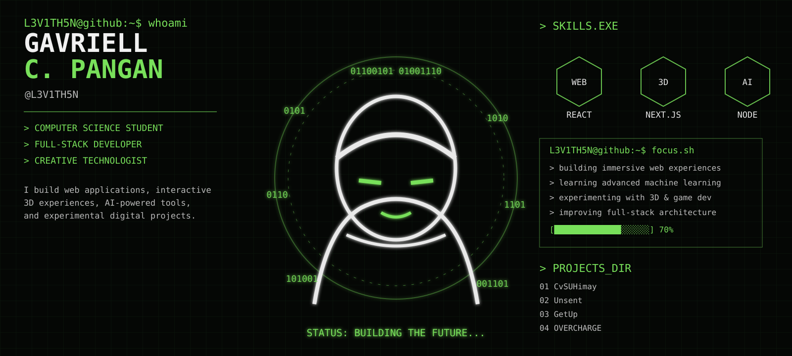

<div align="center">



<br/>

[](https://github.com/L3V1TH5N)
[](https://instagram.com/gaavrielll)

</div>

---

```text
L3V1TH5N@github:~$ cat README.md

> Computer Science student
> Full-stack developer
> 3D / interactive experience enthusiast
> Building things that combine code, design, and experimentation.
```

## `> ABOUT_ME.EXE`

I'm **Gavriell C. Pangan**, a Computer Science student and developer focused on building practical software and creative digital experiences.

I enjoy working across the stack — from interfaces and backend systems to 3D simulations, AI experiments, and game development.

```text
CURRENT_MODE
────────────
[ WEB ]       ███████████████████░  90%
[ 3D ]        ███████████████░░░░░  75%
[ AI / ML ]   █████████████░░░░░░░  65%
[ GAME DEV ]  ████████████░░░░░░░░  60%
```

## `> TECH_STACK.SH`

| Category | Technologies |
|---|---|
| **Languages** | JavaScript · TypeScript · Python · Java · PHP · Dart · GDScript |
| **Frontend** | React · Next.js · HTML5 · CSS3 · Tailwind · Bootstrap |
| **Backend** | Node.js · Express · PHP |
| **Databases** | MySQL · MongoDB · Firebase |
| **3D / Creative** | Three.js · Blender · Godot |
| **AI / ML** | Python · TensorFlow · scikit-learn |
| **Tools** | Git · GitHub · VS Code · Postman |

## `> CURRENTLY_LEARNING`

```text
[+] Advanced 3D Web Development
[+] Three.js / WebGL
[+] Machine Learning
[+] AI-powered applications
[+] Game Development
[+] Better system architecture
```

## `> GITHUB_STATS.EXE`

<div align="center">


</div>

<div align="center">


</div>

## `> ACTIVITY.LOG`

```text
[ SYSTEM ]
──────────
identity     : L3V1TH5N
role         : developer / student
location     : Philippines
focus        : web / 3D / AI / software

[ BUILD ]
─────────
learn → experiment → build → break → improve → repeat
```

## `> CONNECT`

<div align="center">

**Want to build something interesting?**

[GitHub](https://github.com/L3V1TH5N) · [Instagram](https://instagram.com/gaavrielll)

</div>

---

<div align="center">

```text
THE BEST WAY TO PREDICT THE FUTURE
IS TO CREATE IT.

L3V1TH5N@github:~$ █
```

</div>
