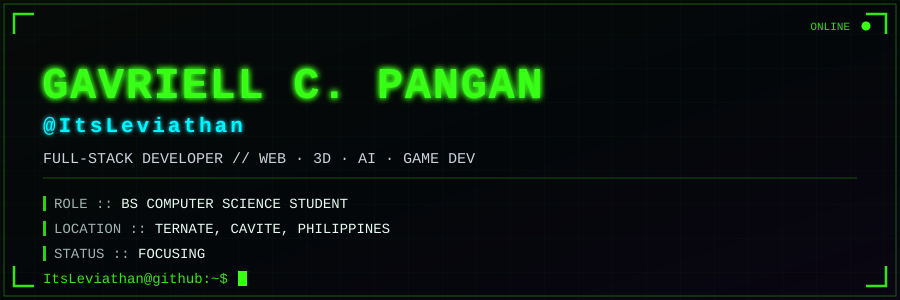
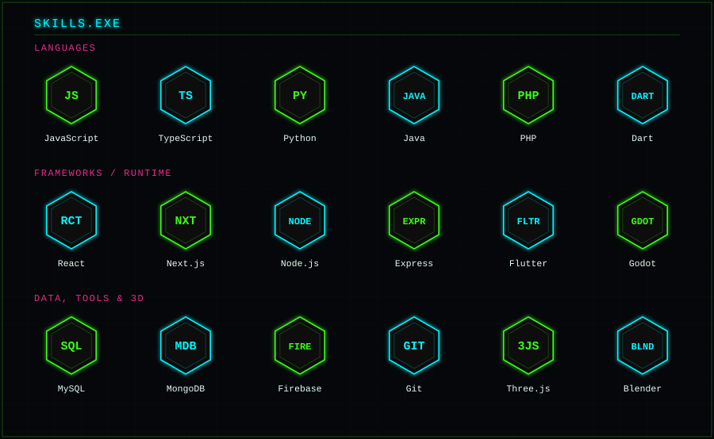

&gt; currently leveling up: <b>machine learning / deep learning</b> &middot; <b>backend system design</b>

## `ItsLeviathan@github:~$ ls -la projects/`

**🐟 [CvSUHimay](https://github.com/ItsLeviathan/CvSUHimay)**
Undergraduate thesis (BSCS, CvSU–Naic) — a gamified e-learning platform with a browser-based 3D bangus deboning simulation driven by a 17-state Mealy FSM, plus quizzes, XP/achievements, and instructor analytics dashboards.
`React 19` `Three.js / R3F` `Node.js` `Express` `MySQL`

**⏰ [GetUp](https://github.com/ItsLeviathan/GetUp)**
An alarm app that forces you out of bed — dismiss it only by photographing a random bathroom item, verified live with on-device AI object detection.
`React Native (Expo)` `TypeScript`

**📁 [ODCI Document Management System](https://github.com/ItsLeviathan/ODCI-Document-Management-System)**
Web platform for organizing, storing, and retrieving digital records — centralizes document workflow and cuts down on manual paperwork.
`PHP` `JavaScript` `CSS`

**💰 [Expense Management System](https://github.com/ItsLeviathan/Expense-Management-System)**
Offline, database-powered expense tracker built for a Municipal Treasurer's Office — categorizes entries by fund type, bank, office, and expense type, with monthly report export.
`PHP` `MySQL`

<a href="https://github.com/ItsLeviathan?tab=repositories">→ view all repositories</a>

## `ItsLeviathan@github:~$ git log --stat`

*"THE BEST WAY TO PREDICT THE FUTURE IS TO CREATE IT."*

`ItsLeviathan@github:~$ _`

