Aspiring Software Engineer and CS student who turns ideas into clean, user-friendly applications. Focused on full-stack development, machine learning, and cloud tech — always leveling up through new projects and tools. Off the keyboard? Probably grinding Valorant.

