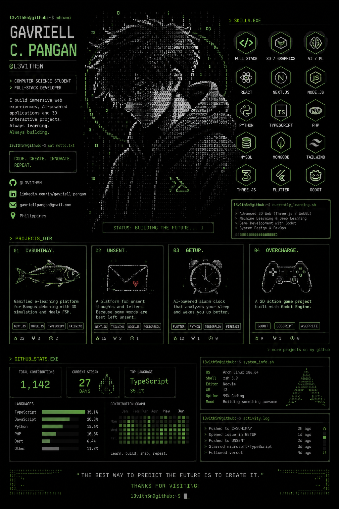

<div align="center">



</div>

<!--
  L3V1TH5N GitHub Profile
  The poster above is the primary visual identity of this profile.
-->

## `> ABOUT_ME.EXE`

```text
L3V1TH5N@github:~$ whoami

Gavriell C. Pangan
Computer Science Student
Full-Stack Developer
Creative Technologist

I build immersive web experiences, AI-powered
applications, 3D interactive projects, and software
that combines engineering with creative design.

CODE. CREATE. INNOVATE. REPEAT.
```

## `> TECH_STACK.SH`

```text
WEB        React · Next.js · Node.js · TypeScript · JavaScript
BACKEND    Node.js · Express · PHP
DATABASE   MySQL · MongoDB · Firebase
3D         Three.js · WebGL
AI / ML    Python · TensorFlow · scikit-learn
MOBILE     Flutter · Dart
GAME DEV   Godot · GDScript
TOOLS      Git · GitHub · VS Code · Postman
```

## `> PROJECTS_DIR`

```text
01  CvSUHimay
    Interactive e-learning platform with a 3D Bangus
    deboning simulator and FSM-based learning flow.

02  Unsent
    A creative platform for thoughts and messages
    that were never sent.

03  GetUp
    An AI-assisted alarm concept designed to make
    getting out of bed an interactive task.

04  OVERCHARGE
    A game-development project built with Godot.
```

## `> GITHUB_STATS.EXE`

<div align="center">


</div>

## `> CURRENTLY_LEARNING`

```text
[+] Advanced 3D Web Development
[+] Three.js / WebGL
[+] Machine Learning
[+] AI-powered applications
[+] Game Development
[+] System Architecture
```

## `> CONNECT`

<div align="center">

[GitHub](https://github.com/L3V1TH5N) · [Instagram](https://instagram.com/gaavrielll)

```text
L3V1TH5N@github:~$ █
```

</div>
